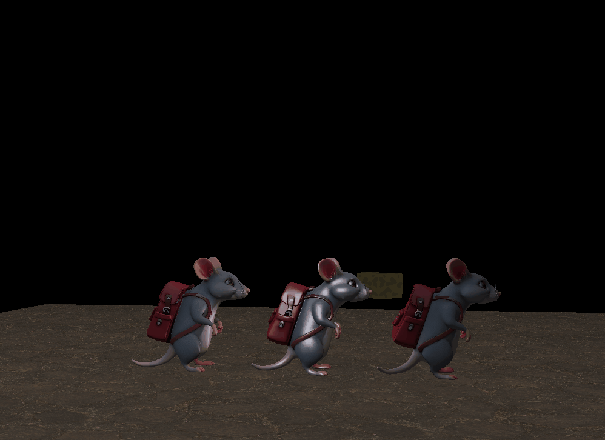

# Diorama Interativo em OpenGL

Este projeto implementa um visualizador 3D interativo usando **C++**, **OpenGL**, **GLFW**, **GLAD**, **GLM** e **stb\_image**, com carregamento de cena via JSON.


---

## 📋 Sumário

* [Visão Geral](#visão-geral)
* [Pré-requisitos](#pré-requisitos)
* [Instalação e Build](#instalação-e-build)
* [Uso](#uso)
* [Controles](#controles)
* [Dependências](#dependências)
* [Licença](#licença)

---

## 🛠️ Pré-requisitos

Para este projeto, siga o tutorial de instalação detalhado em [GettingStarted.md](GettingStarted.md).

---

## 🚀 Instalação e Build

```bash
# Clone o repositório
git clone https://github.com/usuario/diorama.git
cd diorama

Pressione `Ctrl + Shift + P` e execute `CMake: Build`

cd build
cmake --build .
```
---

## ▶️ Uso

```bash
./main
```

Ao executar, a janela será aberta e carregará a cena conforme `config.json`.

---

## 🎮 Controles

* **W/A/S/D**: mover câmera no plano XZ
* **Q/E**: subir/descer câmera
* **Mouse**: olhar ao redor (yaw/pitch)
* **Scroll**: ajustar zoom (FOV)
* **Teclas 1/2/3/...**: selecionar objeto (rat 1, rat 2, rat 3, queijo)
* **X/Y/Z**: rotacionar objeto selecionado no eixo correspondente
* **Esc**: fechar aplicação

---

## 📦 Dependências

* [GLFW](https://www.glfw.org): criação de janela e input
* [GLAD](https://glad.dav1d.de): carregamento de funções OpenGL
* [GLM](https://glm.g-truc.net): matemática linear
* [stb\_image](https://github.com/nothings/stb): carregamento de imagens
* [nlohmann/json.hpp](https://github.com/nlohmann/json): parsing JSON

---

## 📄 Licença

Este projeto está licenciado sob a [MIT License](LICENSE).
